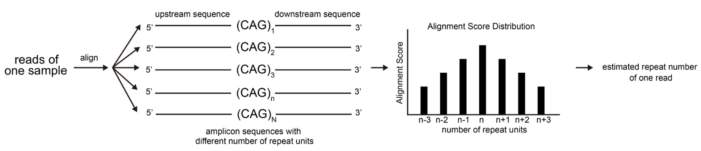
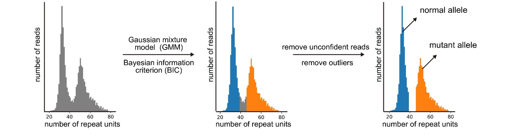

# AmpliconRepeat

AmpliconRepeat is a computational tool for tandem repeat detection from long-read amplicon sequencing data. 

## Features
1) Accurate estimation of repeat size (number of repeat units) from long-read sequencing data
2) Supporting different long-read sequencing platforms (e.g. Oxford Nanpore, PacBio)
3) Classification of reads using Gaussian mixture models (GMM)


## Workflow

AmpliconRepeat generates a series of sequences where the repeat sizes are from 1 to N (a user specified value) with 10 kb left and right flanking sequences. The reads were aligned to this series of sequences using [minimap2](https://github.com/lh3/minimap2) with the parameter for the specified platform. The repeat size of the sequence with the highest alignment score was the estimate of the repeat size of the read. 

<p align="center"></p>

After the repeat size of each read is determined, AmpliconRepeat uses the Gaussian mixture model (GMM) to assign reads to alleles. First, outlier reads with repeat sizes that are outside three standard deviations from the mean are removed. Next, we assume that the repeat size is a mixture of N Gaussian models, where N is 1 or 2 for a diploid genome. We use the Bayesian information criterion (BIC) to select the best N. After the best N is selected, the label of each read is predicted using the trained Gaussian mixture model. In high-confidence mode, a read is discarded if it is not confidently assigned to a Gaussian model (p < 0.95) or if it is outside three standard deviations from the mean of that model.

<p align="center"></p>

## Usage

```
usage: ampliconRepeat.py [-h] --in_fq input.fastq --platform
                         sequencing_platform --ref_amp_seq
                         ref_amplicon_seq.fasta --start_pos start_pos
                         --end_pos end_pos --repeat_seq repeat_seq --out_dir
                         path/to/output_dir [--version]
                         [--method method for splitting alleles]
                         [--fixed_cutoff_value fixed_repeat_count_cutoff_value]
                         [--ploidy ploidy of the sample]
                         [--num_threads number_of_threads]
                         [--max_num_repeat_unit max_num_repeat_unit]
                         [--samtools samtools] [--minimap2 minimap2]
                         [--use_existing_intermediate_files]
                         [--high_conf_only]

Tandem repeat detection from long-read amplicon sequencing data

optional arguments:
  -h, --help            show this help message and exit
  --in_fq input.fastq   input fastq file
  --platform sequencing_platform
                        two valid values: `ont`, `pacbio`
  --ref_amp_seq ref_amplicon_seq.fasta
                        reference amplicon sequence in FASTA format
  --start_pos start_pos
                        start position of the repeat in the reference amplicon
                        sequence (1-based)
  --end_pos end_pos     end position of the repeat in the reference amplicon
                        sequence (1-based)
  --repeat_seq repeat_seq
                        sequence of the repeat unit (e.g. CAG)
  --out_dir path/to/output_dir
                        path to the output directory
  --version             show program's version number and exit
  --method method for splitting alleles
                        three valid values: `fixed`, `gmm`, and `both`
                        (default: `gmm`). If `fixed` or `both` is chosen,
                        --fixed_cutoff_value must be specified.
  --fixed_cutoff_value fixed_repeat_count_cutoff_value
                        split alleles using this fixed_cutoff_value (required
                        if --method is `fixed`)
  --ploidy ploidy of the sample
                        ploidy of the sample (default: 2)
  --num_threads number_of_threads
                        number of threads used by minimap2 (default: 1)
  --max_num_repeat_unit max_num_repeat_unit
                        maximum possible number of the repeat unit (default:
                        200)
  --samtools samtools   path to samtools (default: using environment default)
  --minimap2 minimap2   path to minimap2 (default: using environment default)
  --use_existing_intermediate_files
                        use existing intermediate when rerun the tool
                        (default: False)
  --high_conf_only      only output high confidently phased reads (default:
                        False)
```
