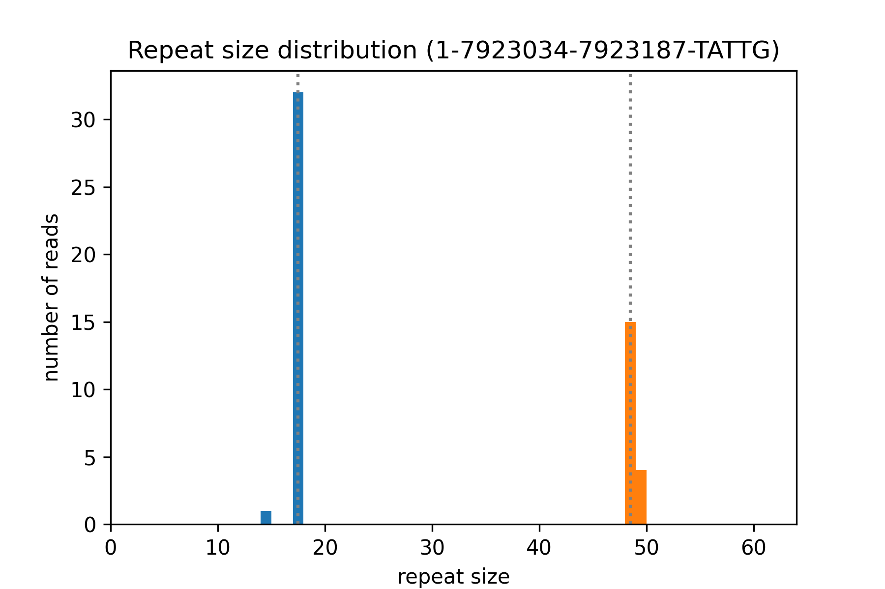
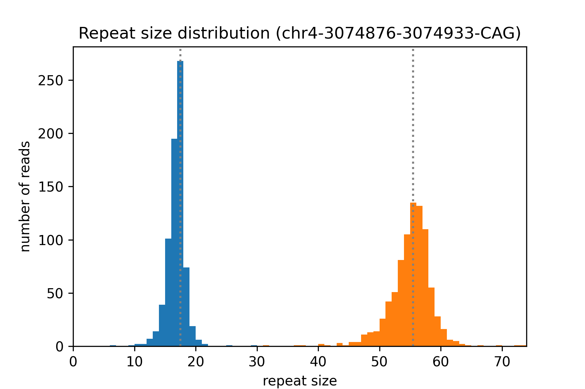
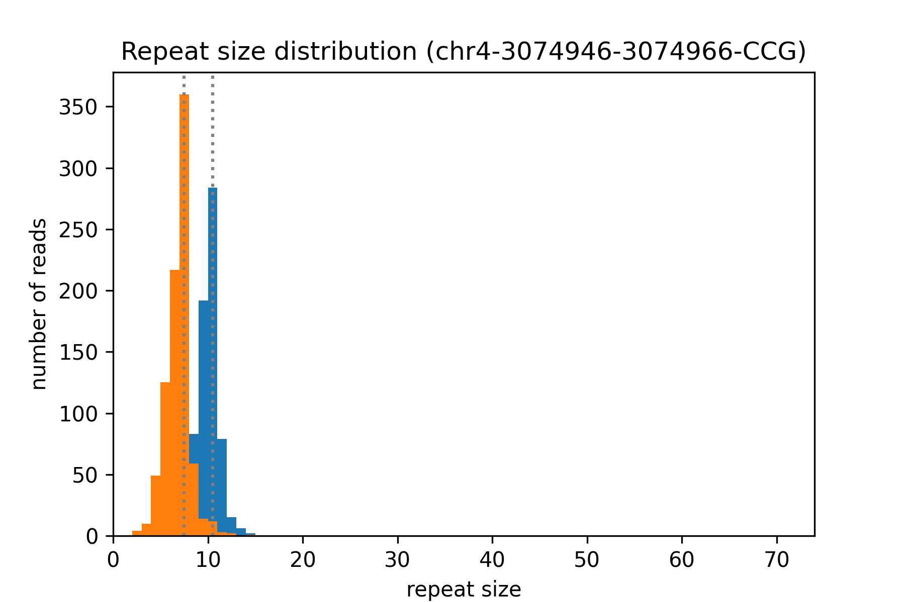
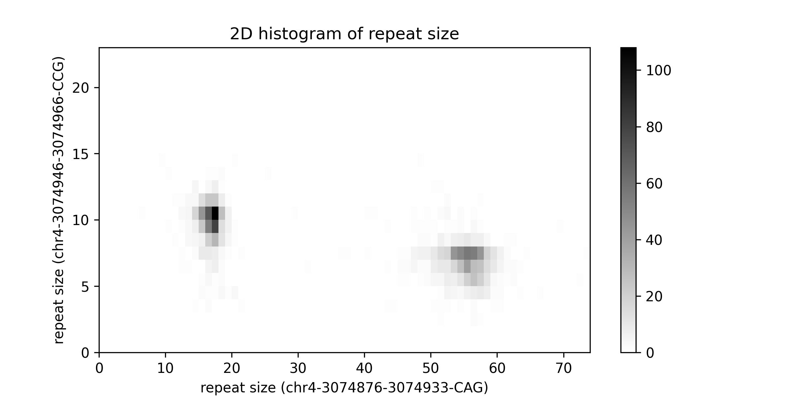
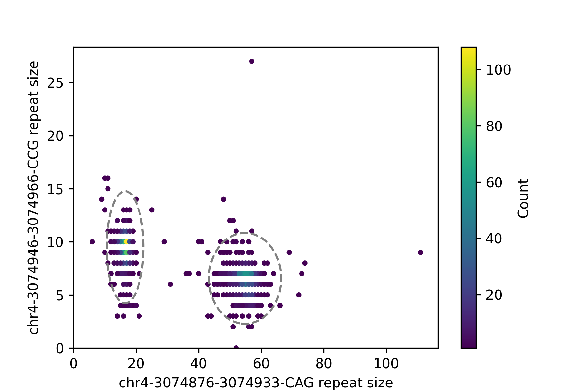

# NanoRepeat: quantification of Short Tandem Repeats (STRs) from long-read sequencing data

[](https://badge.fury.io/py/NanoRepeat)
[](https://www.zenodo.org/record/7024484)

## Table of Contents

- [Installation](#installation)
- [Usage](#usage)
  - [Regular use cases](#regular-use-cases)
  - [Joint quantification of two adjacent repeats](#joint_quantification)
- [Citation](#citation)
- [Limitation](#limitation)
- [Contact Us](#contact-us)

## Installation

#### Prerequisites:

1. [Python](https://www.python.org/downloads/) (version >= 3.8)
2. [Minimap2](https://github.com/lh3/minimap2) (version >= 2.22)
3. [Samtools](https://github.com/samtools/samtools.git) (version >= 1.13)

You may alreadly have `minimap2` and `samtools` if you performed analysis of Oxford Nanopore sequencing data. You can use `which minimap2` and `which samtools` to check the full path to the two executable files. Please note that `minimap2` should be v2.22 or later. 

Once you installed the above tools, you can use the following commands to install NanoRepeat (we recommend creating an new conda environment to avoid dependency issues):

```
conda create -n nanorepeat python=3.8
conda activate nanorepeat
git clone https://github.com/WGLab/NanoRepeat.git
cd NanoRepeat
pip install .
```

If you want to install a stable version from Python Package Index (PyPI): 

```
conda create -n nanorepeat python=3.8
conda activate nanorepeat
pip install NanoRepeat
```
Notice: If you want to install NanoRepeat from a PyPI mirror, please check if the version in the mirror is update to date. 

## Usage

### Regular use cases

NanoRepeat can quantify STRs from targeted sequencing or whole-genome sequencing data. We will demonstrate the usage of NanoRepeat using an example data set, which can be downloaded using the following commands. 

```
wget https://github.com/WGLab/NanoRepeat/releases/download/v1.3/NanoRepeat_v1.3_example_data.tar.bz2
tar xjf NanoRepeat_v1.3_example_data.tar.bz2
```

After unzipping the file, you will see a `NanoRepeat_v1.3_example_data` folder and there are two subfolders: `HG002` and `HTT_amplicon`. In this section, we will use the data under the `HG002` folder. 

```
$ ls -1  ./NanoRepeat_v1.3_example_data/HG002/ 
GRCh37_chr1.fasta
GRCh37_chr1.fasta.fai
HG002_GRCh37_example_regions.bed
hg002_Q20.20210805_3flowcells.hs37d5.example_regions.bam
hg002_Q20.20210805_3flowcells.hs37d5.example_regions.bam.bai
```

You can use the following command to run NanoRepeat: 

```
nanoRepeat.py \
    -i path/to/NanoRepeat_v1.3_example_data/HG002/hg002_Q20.20210805_3flowcells.hs37d5.example_regions.bam \
    -t bam \
    -d ont_q20 \
    -r path/to/NanoRepeat_v1.3_example_data/HG002/GRCh37_chr1.fasta \
    -b path/to/NanoRepeat_v1.3_example_data/HG002/HG002_GRCh37_example_regions.bed \
    -c 4 \
    --samtools path/to/samtools \
    --minimap2 path/to/minimap2 \
    -o ./nanorepeat_output/HG002
```

`-i` specifies the input file, which can be in `fasta`, `fastq` or `bam` format. In this case our input file is `hg002_Q20.20210805_3flowcells.hs37d5.example_regions.bam`. It is a subset of an Oxford Nanopore whole-genome sequencing dataset of the [NIST/GIAB HG002 (GM24385/NA24385)](https://catalog.coriell.org/0/Sections/Search/Sample_Detail.aspx?Ref=NA24385&Product=DNA) genome. The sequencing data was from the [Oxford Nanopore Technologies Benchmark Datasets](https://registry.opendata.aws/ont-open-data/) and reads from 15 example STR regions in `chr1` were extracted. These regions were selected because they overlap with the [HG002 SV benchmark set](https://ftp-trace.ncbi.nlm.nih.gov/giab/ftp/data/AshkenazimTrio/analysis/NIST_SVs_Integration_v0.6/HG002_SVs_Tier1_v0.6.vcf.gz) and are heterozygous (i.e., two alleles have different repeat sizes). 

`-t` specifies the input file type. There are four valid values: bam, cram, fastq or fasta. In this case the input file is in a bam file. 

`-d` specifies the data type. There are five valid values: `ont_q20`, `ont_sup`, `ont`, `hifi`, and `clr`. `ont_q20` is for Oxford Nanopore sequencing with Q20+ chemistry. `ont_sup` is for Oxford Nanopore sequencing with R9 flowcells and basecalled in super accuracy mode. `ont` is for Oxford Nanopore sequencing with R9 flowcells and basecalled in fast mode or high accuracy mode. `hifi` is for PacBio HiFi/CCS reads. `clr` is for PacBio Continuous Long Reads (CLR) reads. Default value: `ont`.

`-r` specifies the reference genome file in `FASTA` format. In this case, `GRCh37_chr1.fasta` is chr1 of the GRCh37/hg19 reference genome. We used GRCh37 instead of GRCh38 because the HG002 SV benchmark set is based on GRCh37. 

`-b` specifies the information of the tandem repeat regions that you are interested in. It is a tab-delimited text file in BED format. There are four required columns: `chromosome`, `start_position`, `end_position`, `repeat_unit_sequence`. In our case, `HG002_GRCh37_example_regions.bed` contains 15 STR regions in chr1 of GRCh37. The first 5 rows of the `HG002_GRCh37_example_regions.bed` are shown below. 

| 1 | 4599903  | 4599930   | TTTAG   |
|---|----------|-----------|---------|
| 1 | 7923034  | 7923187   | TATTG   |
| 1 | 8321418  | 8321465   | TTCC    |
| 1 | 14459872 |  14459935 |  AAAG   |
| 1 | 20934886 |  20934920 |  GTTTT  |

**IMPORTANT NOTICE**
1) Please note that in BED format, all chromosome positions start from 0. `start_position` is self-inclusive but `end_position` is NOT self-inclusive. Tip: If you have 1-based positons, simply decrease the value of `start_position` by 1 and no changes for `end_position`

2) NanoRepeat assumes that the seqeunce between `start_position` and `end_position` are all repeats of the motif specified in the fourth column. There should be neither non-repeat sequences nor other repeat motifs between `start_position` and `end_position`. If a region contains two consecutive repeats, you can specify them in two rows. 

`-c` specifies the number of CPU cores for alignment. 

`-o` specifies the output prefix. Please include the path to the output directory and prefix of output file names. In our case, the output prefix is `./nanorepeat_output/HG002`, which means the output directory is `./nanorepeat_output/` and the prefix of output file names is `HG002`.

`--samtools` and `--minimap2` specifies the path to the two software tools. The two arguments are optional if `samtools` and `minimap2` and be found in your environment. 

If you run NanoRepeat sucessfully, you will see 90 output files (six files per region). Output files of a single repeat region look like this: 

```
HG002.1-7923034-7923187-TATTG.allele1.fastq
HG002.1-7923034-7923187-TATTG.allele2.fastq
HG002.1-7923034-7923187-TATTG.hist.png
HG002.1-7923034-7923187-TATTG.phased_reads.txt
HG002.1-7923034-7923187-TATTG.repeat_size.txt
HG002.1-7923034-7923187-TATTG.summary.txt
```

`HG002.1-7923034-7923187-TATTG.allele1.fastq` and `HG002.1-7923034-7923187-TATTG.allele2.fastq` are reads of each allele. 

`HG002.1-7923034-7923187-TATTG.hist.png` is a histogram showing the repeat size distribution. Each allele has a different color.
<p align="center"></p>


`HG002.1-7923034-7923187-TATTG.phased_reads.txt` shows the phasing results. First 10 lines of the `HG002.1-7923034-7923187-TATTG.phased_reads.txt` are shown below. 

```
$ head HG002.1-7923034-7923187-TATTG.phased_reads.txt
##RepeatRegion=1-7923034-7923187-TATTG
#Read_Name	Allele_ID	Phasing_Confidence	Repeat_Size
746edfa7-715f-4e97-913e-ef73ed97135f	1	HIGH	14.0
d6355053-0ed2-438e-8469-28cabeb2aedf	1	HIGH	17.0
513a749a-6ffc-47c4-a499-9f9222e93abf	1	HIGH	17.0
fc8dc377-8772-4dc0-922d-ad694deec8d7	1	HIGH	17.0
cd847c0e-9fbf-4abf-8f0a-ea938026ef41	1	HIGH	17.0
f53bc376-69b4-4118-87e1-59379c640408	1	HIGH	17.0
9b70cd2a-c1df-447a-a7aa-b5ab8046115e	1	HIGH	17.0
6a9b6f5b-d59d-4dde-9adb-8e6ac91cc6e4	1	HIGH	17.0
```

The columns of the `*.phased_reads.txt` file: 

| Column | Description                                  |
|:------:|----------------------------------------------|
|    1   | Read_Name                                    |
|    2   | Allele_ID                                    |
|    3   | Phasing_Confidence (two values: HIGH or LOW) |
|    4   | Repeat_Size                                  |

`HG002.1-7923034-7923187-TATTG.repeat_size.txt` is the estimated repeat sizes of ALL reads. This file is similar to the `*.phased_reads.txt` file but it also includes reads that may be removed in the phasing process (e.g. reads considered as noisy reads or outliers)

```
$ head HG002.1-7923034-7923187-TATTG.repeat_size.txt
##Repeat_Region=1-7923034-7923187-TATTG
#Read_Name	Repeat_Size
746edfa7-715f-4e97-913e-ef73ed97135f	14.0
d6355053-0ed2-438e-8469-28cabeb2aedf	17.0
dadaf0a0-8797-47ca-a21b-259928edca7e	48.0
513a749a-6ffc-47c4-a499-9f9222e93abf	17.0
07f65d31-4023-4d86-beba-76fb88f2cf45	48.0
4e66c3d0-6f15-4ff7-a8a8-d5c95d57e73d	48.0
fc8dc377-8772-4dc0-922d-ad694deec8d7	17.0
cd847c0e-9fbf-4abf-8f0a-ea938026ef41	17.0
```

`HG002.1-7923034-7923187-TATTG.summary.txt` gives the quantification of the repeat size. It has the following information: 1) repeat region; 2) number of detected alleles; 3) repeat size of each allele; 4) number of reads of each allele; 5) number of removed reads.

```
$ cat HG002.1-7923034-7923187-TATTG.summary.txt
Repeat_Region=1-7923034-7923187-TATTG	Method=GMM	Num_Alleles=2	Num_Removed_Reads=0	Allele1_Num_Reads=33	Allele1_Repeat_Size=17	Allele2_Num_Reads=19	Allele2_Repeat_Size=48
```

### <a name="joint_quantification"> Joint quantification of two adjacent STRs (such as the `CAG` and `CCG` repeats in the HTT gene)

Sometimes two STRs are next to each other. For example, in exon-1 of the human HTT gene, there are two adjacent STRs: `CAG` and `CCG`. The sequence structure is: (CAG)<sub>m</sub>-CAA-CAG-CCG-CCA-(CCG)<sub>n</sub>. NanoRepeat can jointly quantify the two STRs and provide phased results. In our experience, looking at both repeats help generate better quantification results. 
	
We will demonstrate the joint quantification using the same example dataset (described in the above section). If you have not downloaded the dataset, you can execute following commands. 

```
wget https://github.com/WGLab/NanoRepeat/releases/download/v1.3/NanoRepeat_v1.3_example_data.tar.bz2
tar xjf NanoRepeat_v1.3_example_data.tar.bz2
```

After unzipping the file, you will see a `NanoRepeat_v1.2_example_data` folder and there are two subfolders: `HG002` and `HTT_amplicon`. In this section, we will use the data under the `HTT_amplicon` folder. 
	
The input fastq file is here: `./NanoRepeat_v1.2_example_data/HTT_amplicon/HTT_amplicon.fastq.gz`.
	
The reference fasta file is here: `./NanoRepeat_v1.2_example_data/HTT_amplicon/GRCh38_chr4.0_4Mb.fasta`.

You can use the following command to run `NanoRepeat-joint`:
```
nanoRepeat-joint.py  \
    -i ./NanoRepeat_v1.3_example_data/HTT_amplicon/HTT_amplicon.fastq.gz \
    -r ./NanoRepeat_v1.3_example_data/HTT_amplicon/GRCh38_chr4.0_4Mb.fasta \
    -1 chr4:3074876:3074933:CAG:200      \
    -2 chr4:3074946:3074966:CCG:20       \
    -o ./joint_quantification_output/HTT \
    -c 4
```

`-1` and `-2` specify the two repeat regions. The format of `-1`  and `-2` is `chrom:start_position:end_position:repeat_unit:max_size`. The start and end positions are 0-based (the first base on the chromosome is numbered 0). The start position is self-inclusive but the end position is non-inclusive, which is the same as the [BED format](https://genome.ucsc.edu/FAQ/FAQformat.html#format1). For example, a region of the first 100 bases of chr1 is denoted as `chr1:0:100`.  `max_size` is the max repeat length that we consider. Please set `max_size` to be a reasonal number. If `max_size` is too large (e.g. well beyond the max possible number), the speed of joint quantification might be slow.


If you run NanoRepeat sucessfully, you will see the following files in the `./joint_quantification_output` folder. 

```
HTT.allele1.fastq
HTT.allele2.fastq
HTT.chr4-3074876-3074933-CAG.hist.png
HTT.chr4-3074946-3074966-CCG.hist.png
HTT.hist2d.png
HTT.phased_reads.txt
HTT.repeat_size.txt
HTT.scatter.png
HTT.summary.txt
```

`HTT.allele1.fastq` and `HTT.allele2.fastq` are the reads assigned to each allele. 

`HTT.chr4-3074876-3074933-CAG.hist.png` is a histogram showing the repeat size distribution of the first repeat (chr4-3074876-3074933-CAG).

<p align="center"></p>

`HTT.chr4-3074946-3074966-CCG.hist.png` is a histogram showing the repeat size distribution of the second repeat (chr4-3074946-3074966-CCG). 

<p align="center"></p>

`HTT.hist2d.png` is a two-dimensional histogram showing the joint distribution of the two repeats. 

<p align="center"></p>

`HTT.scatter.png` is a scatter plot showing the joint distribution of the two repeats. The dotted lines indicates the 95% equi-probability surface of the Gaussian mixture models.

<p align="center"></p>


`HTT.phased_reads.txt` shows the phasing results. The first line is the path to the input FASTQ file. Lines 2-9 of the `HTT.phased_reads.txt` file are shown below (as a table). 

| #Read_Name | Allele_ID | Phasing_Confidence | chr4-3074876-3074933-CAG.Repeat_Size | chr4-3074946-3074966-CCG.Repeat_Size |
|---|:---:|:---:|:---:|:---:|
| ONT_read330 | 1 | HIGH | 13.5 | 8 |
| ONT_read1284 | 1 | HIGH | 17 | 11.5 |
| ONT_read579 | 1 | HIGH | 16 | 10 |
| ONT_read838 | 1 | HIGH | 15.5 | 10 |
| ONT_read520 | 1 | LOW | 25 | 13 |
| ONT_read1066 | 1 | HIGH | 17.5 | 10 |
| ONT_read1059 | 1 | HIGH | 16 | 10.5 |
| ONT_read526 | 1 | HIGH | 17 | 10 |

The `*summary.txt` file gives the quantification of the repeat sizes. It has the following information: 
1) input file
2) number of alleles
3) number of reads for each allele
4) quantification of repeat sizes of each allele

The content of `HTT.summary.txt` is shown below: 

| Input_FASTQ | path/to/HTT_amplicon.fastq.gz |
|---|---|
| Method | 2D-GMM |
| Num_Alleles | 2 |
| Num_Removed_Reads | 0 |
| Allele1_Num_Reads | 733 |
| Allele1_chr4-3074876-3074933-CAG.Repeat_Size | 17 |
| Allele1_chr4-3074946-3074966-CCG.Repeat_Size | 10 |
| Allele2_Num_Reads | 856 |
| Allele2_chr4-3074876-3074933-CAG.Repeat_Size | 55 |
| Allele2_chr4-3074946-3074966-CCG.Repeat_Size | 7 |


## Citation
If you use NanoRepeat, please cite: 

Fang L, Monteys AM, Dürr A, Keiser M, Cheng C, Harapanahalli A, et al. Haplotyping SNPs for allele-specific gene editing of the expanded huntingtin allele using long-read sequencing. Human Genetics and Genomics Advances. 2023;4(1):100146. DOI: https://doi.org/10.1016/j.xhgg.2022.100146.


BibTeX format: 

```
@article{FANG2023100146,
	title = {Haplotyping SNPs for allele-specific gene editing of the expanded huntingtin allele using long-read sequencing},
	journal = {Human Genetics and Genomics Advances},
	volume = {4},
	number = {1},
	pages = {100146},
	year = {2023},
	issn = {2666-2477},
	doi = {https://doi.org/10.1016/j.xhgg.2022.100146},
	url = {https://www.sciencedirect.com/science/article/pii/S266624772200063X},
	author = {Li Fang and Alex Mas Monteys and Alexandra Dürr and Megan Keiser and Congsheng Cheng and Akhil Harapanahalli and Pedro Gonzalez-Alegre and Beverly L. Davidson and Kai Wang},
	keywords = {Huntington’s disease, long-read sequencing, CRISPR, SNP, repeat detection}
}

```
## Limitation
NanoRepeat can accuratly quantify simple repeats but cannot handle mixed repeats of different motifs (i.e. a mixture of `GCCA` and `AAATT`), but imperfect repeats of approximately the same motif are OK. 

## Contact Us

If you need any help from us, you are welcome to raise an issue at the issue page. You can also contact Dr. Li Fang (fangli9@sysu.edu.cn) or Dr. Kai Wang (wangk@chop.edu).
